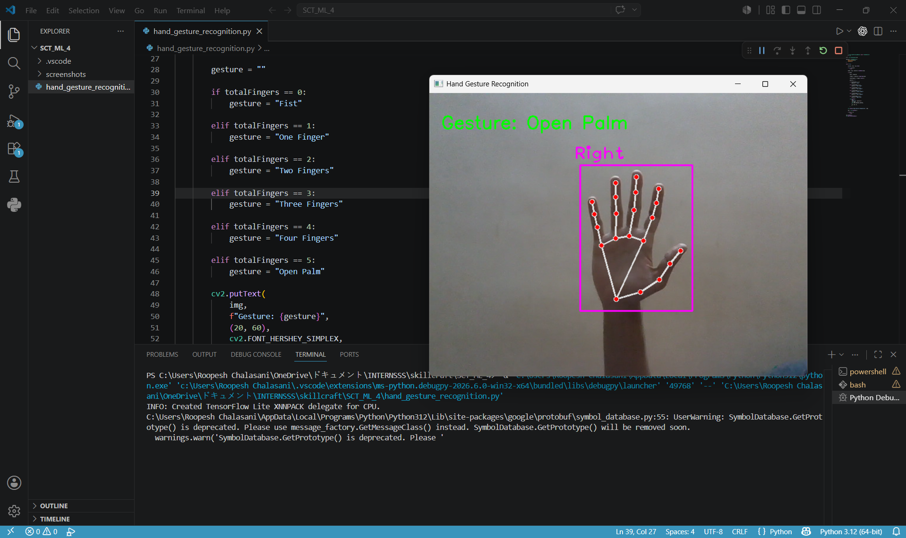
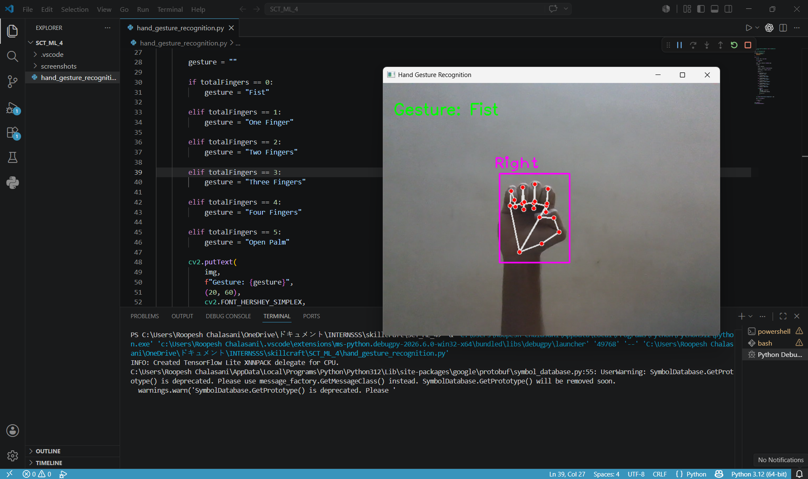
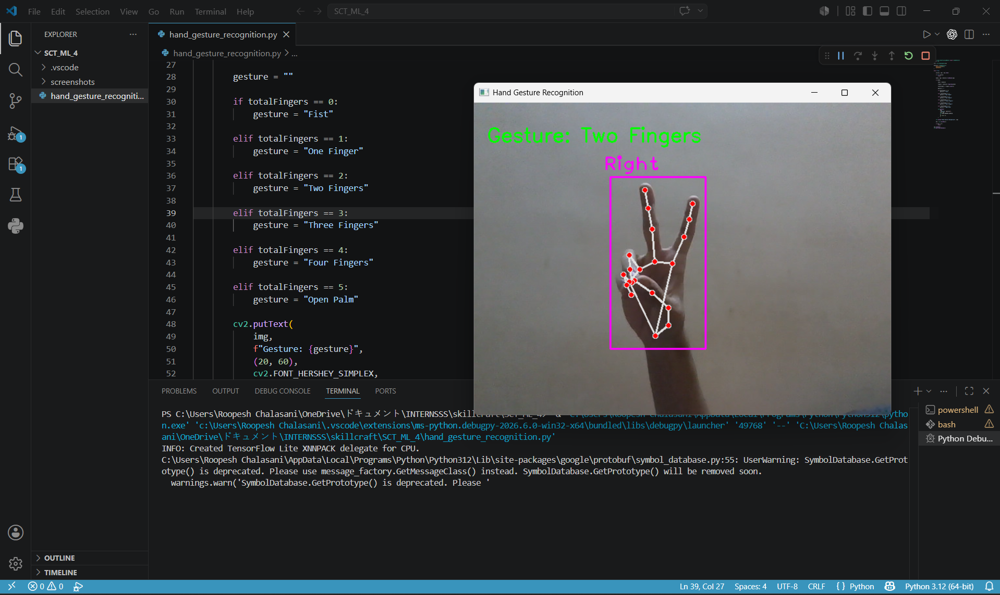

# Hand Gesture Recognition using OpenCV and MediaPipe

## 📌 Project Overview

This project was developed as part of the **Machine Learning Internship at SkillCraft Technology**.

The objective of this project is to build a real-time hand gesture recognition system capable of detecting and classifying different hand gestures using computer vision techniques and webcam input.

---

## 🎯 Task Objective

Develop a hand gesture recognition model that can accurately identify and classify different hand gestures from video data.

---

## 🛠️ Technologies Used

* Python
* OpenCV
* MediaPipe
* CVZone

---

## 🤖 Features

* Real-time webcam-based hand tracking
* Hand landmark detection
* Finger counting
* Gesture classification
* Live visual feedback

---

## ✋ Recognized Gestures

* Open Palm
* Fist
* One Finger
* Two Fingers
* Three Fingers
* Four Fingers

---

## 📊 Project Workflow

1. Capture live webcam feed.
2. Detect hand landmarks using MediaPipe.
3. Count raised fingers.
4. Classify the gesture.
5. Display the detected gesture in real time.

---

## 📷 Project Screenshots

### Open Palm Detection



### Fist Detection



### Two Fingers Detection



### Project Code


### Terminal Execution


---

## 📁 Project Structure

SCT_ML_4/

├── hand_gesture_recognition.py

├── README.md

└── screenshots/

```
├── open_palm_detection.png

├── fist_detection.png

├── two_fingers_detection.png

├── project_code.png

└── terminal_execution.png
```

---

## 🚀 How to Run

### Install Required Libraries

```bash
pip install opencv-python mediapipe cvzone
```

### Run the Project

```bash
python hand_gesture_recognition.py
```

---

## 📚 Learning Outcomes

* Computer Vision Fundamentals
* Hand Landmark Detection
* Real-Time Image Processing
* Gesture Recognition Systems
* Human-Computer Interaction

---

## 🏢 Internship

Completed as **Task 04** of the **Machine Learning Internship at SkillCraft Technology**.

---

## 👨‍💻 Author

Roopesh Chalasani

Machine Learning Intern

SkillCraft Technology
